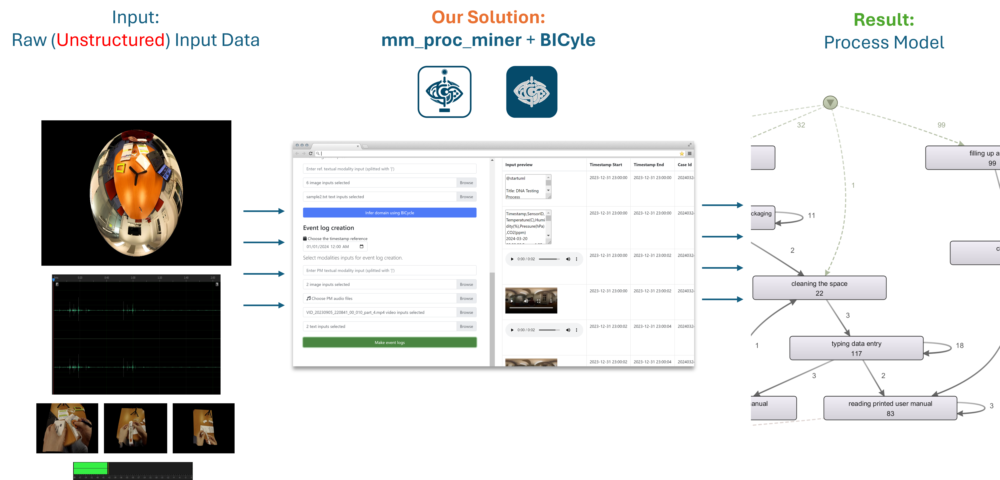
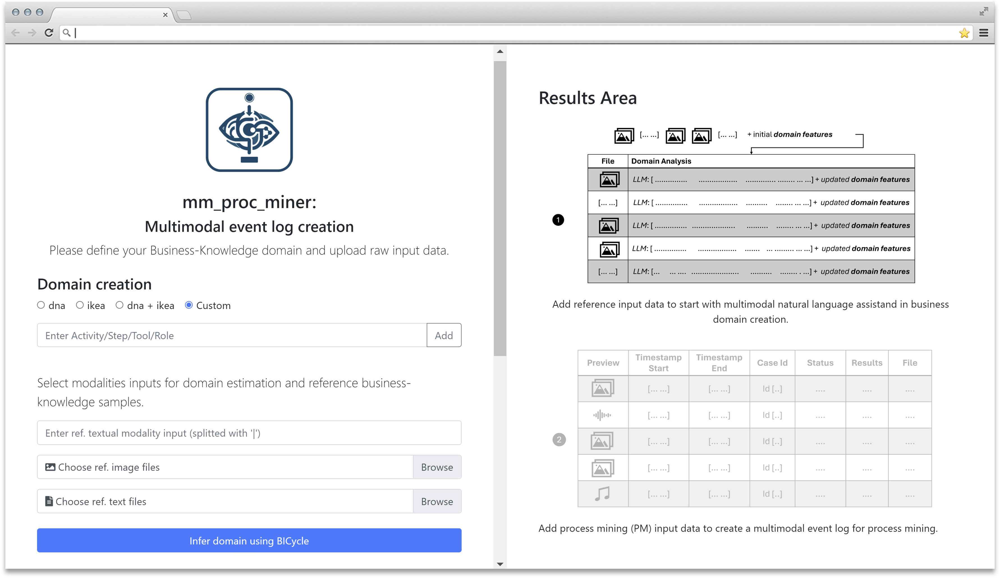
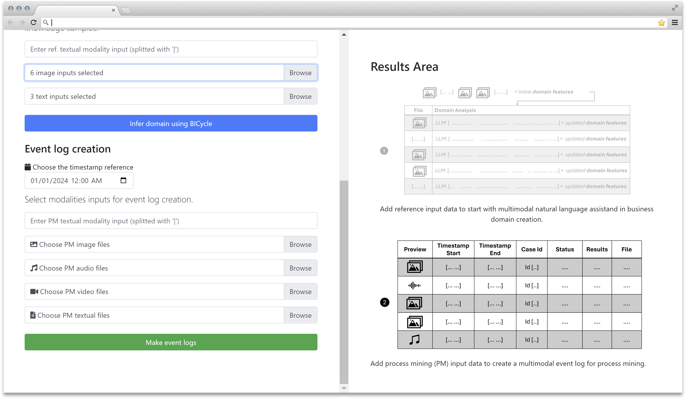
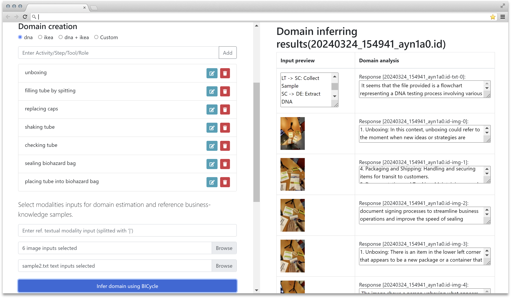
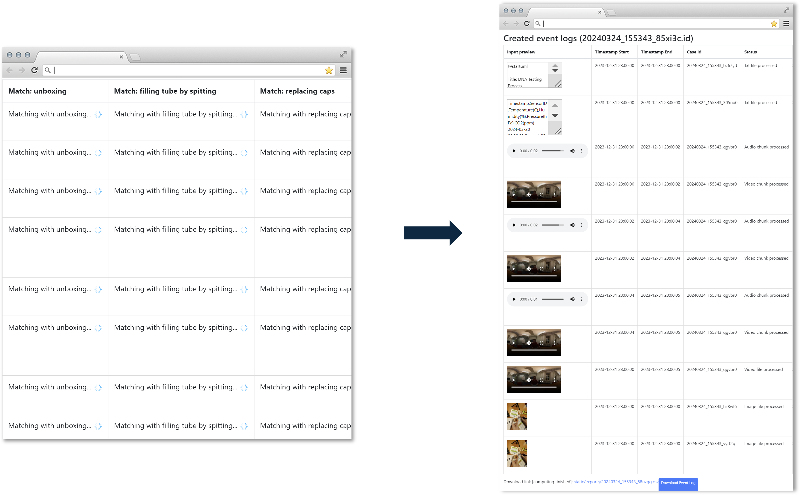

# Supplementary Material for "Multimodal Process Mining with the Business-knowledge Integration Cycles Method"

This repository contains supplementary materials for the paper titled "Multimodal Process Mining with the Business-knowledge Integration Cycles Method" submitted to ICPM 2024.

## mm_proc_miner demo



Raw data, representing diverse modalities of business processes, is ingested on the left side of our architecture. Through the Multimodal Process Miner \(mm_proc_miner\) andBusiness-knowledge Integration Cycles Method, our solution operates in the center, systematically blending domain expertise with data-driven insights to enhance process mining accuracy and relevance. Leveraging Disco, a process mining tool, the solution produces refined process models, showcased on the right.

<div style="text-align:center;">
<video width="300" height="260" controls>
  <source src="solution_demo.mp4" type="video/mp4">
  Your browser does not support the video tag.
</video>

In this demonstration, we provide a hands-on experience of our architecture's functionality. 
</div>

### Input section - Domain Creation


This section is for defining the domain of business knowledge for which the event log is to be created.

- **dna:**  A predefined domain template.
- **ikea:** Another predefined template - example domain.
- **dna + ikea:** A combination of the two domains, suggesting that multiple domains can be merged.
- **Custom:** This allows the user to input custom domain specifications, such as activities, steps, tools, or roles within a process.

#### Select Modalities Inputs
This is where the user provides the data to estimate the domain.

- The text entry box accepts textual data, with individual entries split by the pipe character (|).
- **Choose ref. image files:** This button enables uploading image files as part of the event log creation.
- **Choose ref. text files:** Similarly, this allows for the uploading of textual data files.
- **Infer Domain Using BICycle:** An action button that starts the process of domain inference.


### Input section - Multimodal Event Log Creation


This section is for uploading the process mining ready input data (raw multimodal data) that will be used for creating the event log.

#### Choose the Timestamp Reference
Users can set a deafult reference timestamp for the input data which will be used if the creation date is not available in metadata of the input files. Event logs require a starting point or a reference time to which all events will be related.

#### Select Modalities Inputs for Event Log Creation
This section allows users to specify and upload various types of data inputs to be included in the event log.

- **Enter PM textual modality input:** PM stands for Process Mining. Users can enter text-based data traces related to the process, split by '|', for inclusion in the event logs.
- **Choose PM image files:** Users can upload image files relevant to the process mining tasks.
- **Choose PM audio files:** This option allows for the uploading of audio files
- **Choose PM video files:** Similarly, users can upload video files including implicit audio data.
- **Choose PM textual files:** In addition to direct text input, this allows users to upload files containing textual data (csv, markdown etc.).

#### Make Event Logs
This button triggers the processing of the input data to generate the event logs. Once clicked, it starts the compilation of data from the different modalities into a structured event log that can be used for analysis and process optimization.

### Results - Domain Creation


The Results Area in Domain Creation, positioned on the right side of the interface, provides users with insights and previews regarding the domain inferences derived from the input files and annotated domain features. It serves users an overview of the inferred domain estimations presented alongside references input files and annotated domain features displayed on the left side of the interface. 

### Results - Multimodal Event Log Creation


The Results Area is showcasing the created event log enriched with essential details for user understanding and analysis. At the forefront, users can observe timestamps aligned with each event, ensuring temporal coherence within the log. Additionally, the inclusion of CaseIDs facilitates the organization and tracking of individual cases or processes within the log. It provides users with an input preview while initial inputs are broken down into atomic components - videos are  dissected into their constituent audio and visual elements. 

Users are presented with the top three domain feature matches alongside the probability of each match with the provided input. A download button is offered, enabling users to effortlessly retrieve the event logs in CSV format for offline processing, archival purposes, and to facilitate further analysis and integration with external tools.

## How to Run


### Prerequisites

Before starting, ensure you have the following installed on your system:

- Git
- Conda (Anaconda or Miniconda)
- Python 3.8 or newer

For Windows users, additional steps are required for installing specific dependencies for audio file handling.

### Setup Instructions

### 1. Clone the Repository

First, you'll need to clone the repository into your desired code folder. Open a terminal or command prompt and run the following command:

```bash
git clone https://github.com/facebookresearch/ImageBind.git
cd ImageBind
```
Move all contents to the ./code directory:

```bash
mv * ../code/
cd code
```
This command moves all files and directories from ImageBind to ./code, excluding hidden files (those starting with .). 

### 2. Create and Activate the Conda Environment

After cloning the repository, you'll need to create a new Conda environment using the `environment.yml` file provided in the repository. Run the following command:

```bash
conda env create -f environment.yml
conda activate bicycleBPM
```


### 2a. Additional Steps for Windows Users

Windows users may need to install `soundfile` for reading and writing audio files. This can be done using `pip`:

```bash
pip install soundfile
```

### 5. Running the Server

Once the environment is set up and all dependencies are installed, you can start the server by running:

```bash
python ./code/server.py
```

By default, the server will run on `localhost` at port `5000`. You can access the solution by navigating to `http://localhost:5000` in your web browser.


## Datasets structure

Multimodal Business Processes dataset is given in the form of (1) filtered and processed form, (2) LLM sources - [gpt4, gpt3.5, gemini advanced, gemini] and (3) breakdown of activities and domain pairs:
```bash
+-- datasets
|   +-- (1) MultimodalBusinessProcesses_dataset.csv
|   +-- (2) MMBP_sources.xlsx
|   +-- (3) MMBP_activities_dataset.csv
```

Evaluation data contains multimodal data in the domain of DNA collecting homekit. Evaluation data is structured as follows:
```bash
+-- testdata
|   +-- dna_audio_src1
|   |   +-- example1.mp3
|   |   +-- ...
|   +-- dna_audio_src2
|   |   +-- example1.mp3
|   |   +-- ...
|   +-- dna_images_360
|   |   +-- example1.jpeg
|   |   +-- ...
|   +-- dna_images_pov
|   |   +-- example1.jpeg
|   |   +-- ...
|   +-- dna_videos_360
|   |   +-- example1.mp4
|   |   +-- ...
|   +-- dna_videos_pov
|   |   +-- example1.mp4
|   |   +-- ...
```
Additional textual samples for demonstrations are given at:
```bash
|   +-- dna_txts
|   |   +-- example1.txt
|   |   +-- ...
```

## Reproducibility of Results presented in "Multimodal Process Mining with the Business-knowledge Integration Cycles Method"

To repoduce our results run script from './code':
```bash
python run_evaluation.py
```
Then merge exported results chunks using scripts from './code/process_data/'.

NOTE: Certain scripts from './code/process_data/' may have conflicting dependencies with the current conda environment. Therefore, we recommend creating a new environment and installing the necessary dependencies to avoid potential conflicts.

NOTE: \[UserWarning\] The 'torchvision.transforms._transforms_video' module is deprecated since 0.12 and will be removed in the future. Please use the 'torchvision.transforms' module instead.